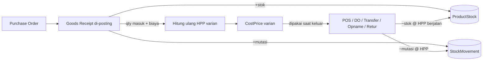
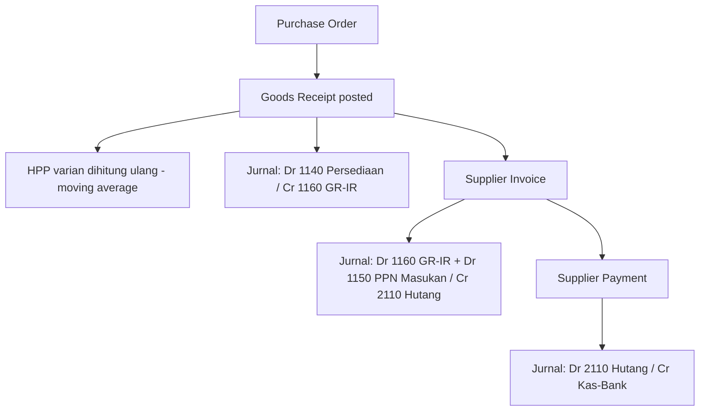

# Proses Bisnis & Operasional: HPP dan COA (ErpOne)

**Dokumen referensi** — menjelaskan bagaimana **Harga Pokok Penjualan (HPP / moving average)** dan **Chart of Accounts (COA / akuntansi)** bekerja secara operasional di ErpOne, apa adanya sesuai sistem berjalan.

> Dua konsep ini adalah jantung angka keuangan ErpOne. HPP menentukan **nilai persediaan & laba kotor**; COA + auto-posting menentukan **jurnal, buku besar, dan laporan keuangan**. Keduanya bertemu di setiap transaksi barang.

---

## Bagian A — HPP (Harga Pokok / Moving Average)

### A.1 Konsep

- Setiap **varian produk (SKU)** punya satu angka HPP berjalan: `CostPrice` (moving average).
- HPP bersifat **global per varian** — satu nilai untuk semua gudang (bukan per gudang).
- Sumber kebenaran mutasi = **`StockMovement`** (buku besar stok, *append-only*: tidak pernah diubah/dihapus). Setiap mutasi menyimpan qty bertanda (+ masuk / − keluar) dan **UnitCost** (HPP saat mutasi).
- Saldo stok termaterialisasi di **`ProductStock`** per (varian × gudang).

### A.2 Kapan HPP **berubah** — hanya saat barang MASUK

HPP dihitung ulang **hanya pada mutasi masuk**:

| Kejadian | Efek HPP |
|---|---|
| **Penerimaan Barang (GRN) di-posting** | HPP dihitung ulang (moving average) memakai qty & biaya penerimaan |
| **Saldo Awal / Opening stock** | Satu mutasi masuk + hitung ulang HPP |

**Rumus moving average** (saat barang masuk):

```
HPP_baru = (qty_sebelum × HPP_lama + qty_masuk × biaya_masuk) / (qty_sebelum + qty_masuk)
HPP_baru dibulatkan 2 desimal (pembulatan menjauh dari nol)
```

`qty_sebelum` = total stok varian tersebut **di seluruh gudang** sebelum mutasi ini.

**Contoh angka:**

| Langkah | Qty | Biaya/unit | Total qty | HPP berjalan |
|---|---|---|---|---|
| Saldo awal | +100 | 1.000 | 100 | 1.000,00 |
| Terima (GRN) | +50 | 1.300 | 150 | (100×1.000 + 50×1.300) / 150 = **1.100,00** |
| Jual | −40 | (pakai 1.100) | 110 | 1.100,00 *(tak berubah)* |
| Terima (GRN) | +60 | 1.250 | 170 | (110×1.100 + 60×1.250) / 170 = **1.152,94** |

### A.3 Kapan HPP **TIDAK berubah** — semua barang KELUAR / koreksi

Semua mutasi keluar memakai **HPP berjalan saat itu** sebagai UnitCost mutasi, tetapi **tidak menghitung ulang** moving average:

| Kejadian | Perlakuan |
|---|---|
| Penjualan POS | Keluar @ HPP berjalan (di-*snapshot* ke baris penjualan sebagai COGS) |
| Pengiriman (Delivery Order) B2B | Keluar @ HPP berjalan (di-set ke baris DO saat posting) |
| Transfer antar gudang | Keluar dari gudang asal & masuk gudang tujuan @ HPP yang sama (internal move, nilai tak berubah) |
| Stock Opname (selisih) | Selisih diposting @ HPP berjalan; MA tak diubah |
| **Retur Pembelian** (rencana Fase 2a) | Keluar @ HPP baris GRN; MA tak diubah |

Prinsip: **HPP hanya "belajar" dari pembelian**; pengeluaran memakai nilai yang sudah ada. Ini membuat HPP dapat diprediksi dan tahan terhadap urutan transaksi.

### A.4 Alur singkat



---

## Bagian B — COA (Chart of Accounts)

### B.1 Struktur akun

- Akun bersifat **hierarkis** (`ParentId`): akun induk = **grup** (header), akun anak = detail.
- Hanya akun **postable** (leaf/paling bawah) yang boleh dijurnal. Akun header hanya untuk pengelompokan & subtotal laporan.
- **Tipe akun**: Asset, Liability, Equity, Revenue, Expense.
- **Sisi normal (Normal Balance)** dihitung dari tipe (tidak disimpan):
  - Asset & Expense → **Debit**
  - Liability, Equity, Revenue → **Kredit**

### B.2 Daftar COA standar (di-seed otomatis)

Saat pertama kali dijalankan, sistem menanam 29 akun standar Indonesia (idempoten — hanya bila tabel akun masih kosong):

| Kode | Nama | Tipe | Postable | Peran sistemik |
|---|---|---|---|---|
| 1000 | Aset | Asset | — (header) | |
| 1100 | Aset Lancar | Asset | — (header) | |
| 1110 | Kas | Asset | ✓ | **Kas POS / kas default** |
| 1120 | Bank | Asset | ✓ | |
| 1130 | Piutang Usaha | Asset | ✓ | **AR (piutang)** |
| 1140 | Persediaan Barang | Asset | ✓ | **Inventory (persediaan)** |
| 1150 | PPN Masukan | Asset | ✓ | **Input Tax** |
| 1160 | Barang Diterima Belum Ditagih | Asset | ✓ | **GR-IR** |
| 1200 | Aset Tetap | Asset | — (header) | |
| 1210 | Peralatan | Asset | ✓ | |
| 1290 | Akumulasi Penyusutan | Asset | ✓ | |
| 2000 | Kewajiban | Liability | — (header) | |
| 2100 | Kewajiban Lancar | Liability | — (header) | |
| 2110 | Hutang Usaha | Liability | ✓ | **AP (hutang)** |
| 2120 | PPN Keluaran | Liability | ✓ | **Output Tax** |
| 2130 | Hutang Pajak | Liability | ✓ | |
| 3000 | Ekuitas | Equity | — (header) | |
| 3100 | Modal | Equity | ✓ | |
| 3200 | Laba Ditahan | Equity | ✓ | |
| 3900 | Saldo Awal (Opening Balance Equity) | Equity | ✓ | **Lawan jurnal saldo awal** |
| 4000 | Pendapatan | Revenue | — (header) | |
| 4100 | Penjualan | Revenue | ✓ | **Sales (pendapatan)** |
| 4200 | Diskon Penjualan | Revenue | ✓ | |
| 5000 | Harga Pokok Penjualan | Expense | — (header) | |
| 5100 | Harga Pokok Penjualan | Expense | ✓ | **COGS** |
| 6000 | Beban Operasional | Expense | — (header) | |
| 6100 | Beban Gaji | Expense | ✓ | |
| 6200 | Beban Sewa | Expense | ✓ | |
| 6300 | Beban Utilitas | Expense | ✓ | |
| 6900 | Beban Lain-lain | Expense | ✓ | **Default GL kategori beban** |

### B.3 PostingConfiguration — pemetaan akun sistemik

Auto-posting tidak menebak akun; ia membaca satu baris **PostingConfiguration** (Settings → Posting Configuration) yang memetakan 9 akun kunci:

| Peran | Akun default | Dipakai untuk |
|---|---|---|
| AR | 1130 Piutang Usaha | Invoice & penerimaan pelanggan |
| AP | 2110 Hutang Usaha | Invoice & pembayaran supplier |
| Inventory | 1140 Persediaan Barang | Nilai persediaan masuk/keluar |
| GR-IR | 1160 Barang Diterima Belum Ditagih | Jembatan terima ↔ tagih |
| Sales | 4100 Penjualan | Pendapatan (B2B & POS) |
| COGS | 5100 Harga Pokok Penjualan | Beban pokok saat barang keluar |
| Input Tax | 1150 PPN Masukan | PPN pembelian |
| Output Tax | 2120 PPN Keluaran | PPN penjualan |
| POS Cash | 1110 Kas | Kas penerimaan POS + kas default |

**Default GL master:**
- Setiap **Cash/Bank Account** yang belum dipetakan → default ke **1110 Kas**.
- Setiap **Kategori Beban** yang belum dipetakan → default ke **6900 Beban Lain-lain**.

> Bila sebuah akun sistemik belum dipetakan saat auto-posting butuh, sistem **gagal-keras (fail-hard)**: transaksi dibatalkan (rollback) dengan pesan jelas. Ini menjaga integritas jurnal.

---

## Bagian C — Auto-Posting (Jurnal Otomatis)

### C.1 Prinsip

- Setiap transaksi operasional yang di-*posting* otomatis membuat **jurnal double-entry** (debit = kredit).
- Jurnal bertanda sumber **System** dan **idempoten** by (jenis dokumen, id dokumen) — tidak akan dobel walau dipanggil ulang.
- Jurnal disisipkan **di dalam transaksi database yang sama** dengan dokumennya (atomik: dokumen & jurnal jadi/batal bersama).
- Jurnal System **tidak bisa diedit/hapus** manual; pembatalan dilakukan via **jurnal balik (reversal)** otomatis saat void.
- Nomor jurnal (JV) diambil dari penomoran terpusat.

### C.2 Matriks jurnal per transaksi

| Transaksi | Debit | Kredit | Nilai |
|---|---|---|---|
| **Penerimaan Barang (GRN)** | 1140 Persediaan | 1160 GR-IR | Σ qty × HPP terima |
| **Invoice Supplier** | 1160 GR-IR (netto) + 1150 PPN Masukan (pajak) | 2110 Hutang Usaha (total) | sesuai invoice |
| **Pembayaran Supplier** | 2110 Hutang Usaha | Kas/Bank (mapped, else 1110) | jumlah bayar |
| **Invoice Pelanggan** | 1130 Piutang Usaha (total) | 4100 Penjualan (netto) + 2120 PPN Keluaran (pajak) | sesuai invoice |
| **Pengiriman (Delivery Order)** | 5100 HPP | 1140 Persediaan | Σ qty × HPP |
| **Penerimaan Pelanggan** | Kas/Bank | 1130 Piutang Usaha | jumlah terima |
| **Beban (Expense)** | GL kategori beban (mis. 6xxx) | Kas/Bank | jumlah beban |
| **Penjualan POS** | 1110 Kas POS (total) | 4100 Penjualan (netto) + 2120 PPN Keluaran (pajak) | + Dr 5100 HPP / Cr 1140 Persediaan (COGS) |
| **Refund/Void POS** | 4100 Penjualan (netto) + 2120 PPN Keluaran | 1110 Kas POS (total) | + Dr 1140 Persediaan / Cr 5100 HPP (proporsional) |
| **Void dokumen** (payment/receipt/expense) | — | — | jurnal balik (reversal) dari JE asal |

### C.3 Jembatan GR-IR (Barang Diterima Belum Ditagih)

Akun **1160 GR-IR** memisahkan peristiwa **terima barang** dari **terima tagihan**:

1. **GRN**: `Dr Persediaan / Cr GR-IR` → persediaan bertambah, timbul kewajiban "barang diterima belum ditagih".
2. **Invoice Supplier**: `Dr GR-IR (+PPN Masukan) / Cr Hutang Usaha` → GR-IR ditutup, berpindah jadi Hutang Usaha resmi.
3. **Pembayaran**: `Dr Hutang Usaha / Cr Kas/Bank`.

Alur: **Persediaan naik → GR-IR → Hutang Usaha → Kas keluar.**

---

## Bagian D — Alur Operasional End-to-End

### D.1 Siklus Pembelian (HPP + COA menyatu)



Contoh (terima 50 unit @ 1.300, PPN 11%):
- GRN: `Dr Persediaan 65.000 / Cr GR-IR 65.000` + HPP varian dihitung ulang.
- Invoice: `Dr GR-IR 65.000 + Dr PPN Masukan 7.150 / Cr Hutang 72.150`.
- Bayar: `Dr Hutang 72.150 / Cr Bank 72.150`.

### D.2 Siklus Penjualan B2B

- **Invoice Pelanggan**: `Dr Piutang (total) / Cr Penjualan (netto) + Cr PPN Keluaran (pajak)`.
- **Delivery Order (posting)**: `Dr HPP / Cr Persediaan` (memakai HPP berjalan) — inilah saat **laba kotor** terbentuk (Penjualan − HPP).
- **Penerimaan Pelanggan**: `Dr Kas/Bank / Cr Piutang`.

### D.3 Siklus Penjualan POS (ritel)

Satu transaksi POS langsung membuat 2 pasang jurnal:
- Sisi pendapatan: `Dr Kas POS (total) / Cr Penjualan (netto) + Cr PPN Keluaran (pajak)`.
- Sisi persediaan: `Dr HPP / Cr Persediaan` (COGS = qty × HPP berjalan, di-snapshot ke baris POS).

Refund/void POS membalik proporsional kedua pasang jurnal + mengembalikan stok.

---

## Bagian E — Laporan Keuangan (bagaimana angkanya muncul)

Semua laporan akuntansi adalah **query atas baris jurnal** (`JournalEntryLine`), tanpa tabel saldo terpisah:

- Yang dihitung = baris jurnal yang **berstatus bukan Draft** (Posted **dan** Reversed dua-duanya ikut, agar jurnal balik saling meniadakan/net).
- **Buku Besar (General Ledger)** & **Neraca Saldo (Trial Balance)**: agregasi debit/kredit per akun.
- **Neraca (Balance Sheet)** — *as-of date*: saldo per akun di-*roll-up* mengikuti hierarki COA. Nilai natural = Σ(Debit − Kredit) untuk Asset/Expense, dan −Σ(Debit − Kredit) untuk lainnya. Baris sintetis **"Laba Tahun Berjalan"** (= Σ Pendapatan − Σ Beban s.d. tanggal) ditambahkan di Ekuitas agar Neraca seimbang.
- **Laba Rugi (Income Statement)** — *periode*: Pendapatan − (HPP + Beban).
- Akun bersaldo 0 dilewati.

### Saldo awal & pembalikan

- **Saldo awal akun** diinput lewat jurnal biasa dengan lawan **3900 Saldo Awal**.
- **Reverse jurnal** = jurnal balik (debit↔kredit ditukar) yang langsung di-posting; JE asal ditandai *Reversed*.

---

## Ringkasan Akun Kunci (cheat sheet)

| Kejadian bisnis | Akun bergerak |
|---|---|
| Beli & terima barang | 1140 Persediaan ↑, 1160 GR-IR ↑ |
| Terima tagihan supplier | 1160 GR-IR ↓, 1150 PPN Masukan ↑, 2110 Hutang ↑ |
| Bayar supplier | 2110 Hutang ↓, Kas/Bank ↓ |
| Jual (invoice) | 1130 Piutang ↑, 4100 Penjualan ↑, 2120 PPN Keluaran ↑ |
| Kirim barang (DO) / POS | 5100 HPP ↑, 1140 Persediaan ↓ |
| Terima pembayaran pelanggan | Kas/Bank ↑, 1130 Piutang ↓ |
| Jual POS (kas) | 1110 Kas ↑, 4100 Penjualan ↑, 2120 PPN Keluaran ↑, 5100 HPP ↑, 1140 Persediaan ↓ |
| Beban operasional | 6xxx Beban ↑, Kas/Bank ↓ |

---

*Dokumen ini mencerminkan implementasi ErpOne per 2026-07-20 (COA standar + engine auto-posting Fase 5). Untuk mengubah akun yang dipakai auto-posting, sesuaikan di Settings → Posting Configuration.*
